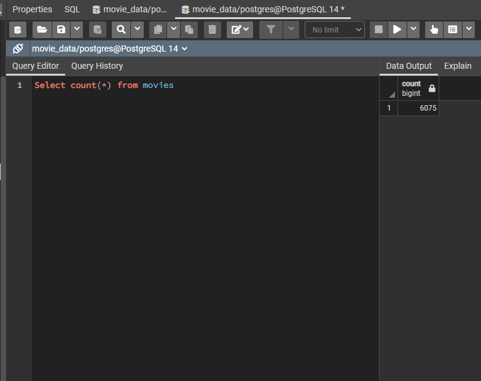
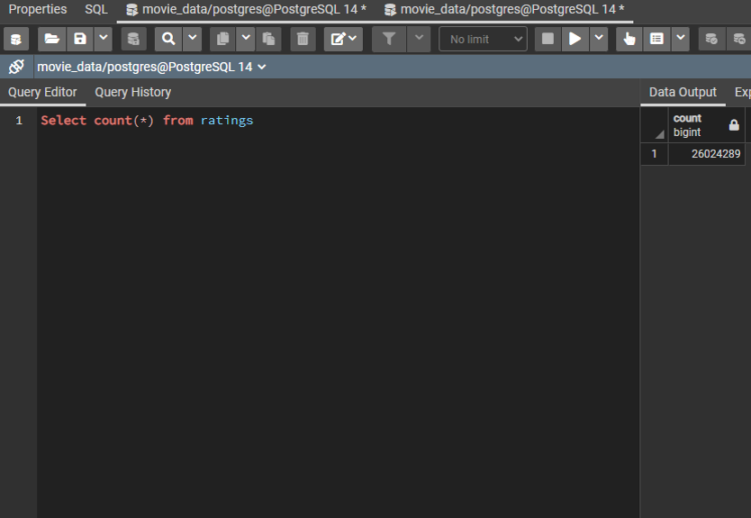

# A Description of Steps Taken To Create a Movie Database

## **Jupyter Notebook Files**:
- [ETL_function_test](ETL_function_test.ipynb)
- [ETL_clean_wiki_movies](ETL_clean_wiki_movies.ipynb)
- [ETL_clean_kaggle_data](ETL_clean_kaggle_data.ipynb)
- [ETL_create_database](ETL_create_database.ipynb)

## **Overview**:
In order to apply the Extract, Transform and Load process of data analysis to real-world data, three different files were used to create a database in PostgreSQL that would make the relevant data accessible for anyone interested in accessing a large source of movie data. Through a process of four steps, the data was read into Jupyter Notebook and adjusted into a usable formats that could then be combined and exported into two tables in a PostgreSQL database.

## **Process**:
For the intial part of the project, a pair of CSV files and a JSON source file were read through Pandas into Jupyter Notebook. The movie data was then processed into a cleaned form over the course of several steps in a constructed function until a dataframe could be created with accurate and usable data. The database was then created in PostgreSQL with pg Admin and linked to the Jupyter Notebook file to export the "movies" dataframe and the "ratings" CSV file's data into the database's tables once the function's code was executed. To ensure the successful creation of the database, a query to count the rows in each of the tables was run and compared to the expected number of rows to be present. With each query, the numbers were exactly what they were expected to be, meaning the database's construction was a success. For the two tables in question, a screenshot of the query given and the response from PostgreSQL are included below.

- 

- 

## **Concluding Thoughts**:
After creating this database, a conclusion can be drawn from a few thoughts about how valuable SQL and the ETL process are that remained throughout the completion of this project. The powerful ways SQL can be applied in data analysis were made increasingly clearer as the steps in this project were completed, and the implications of how much more can be done with such a tool are wide-reaching and extremely impressive. Though the steps in the ETL process that were needed to improve the presentation of the data were tedious in some cases, the end result of processing over 26 million rows of data and having them accessible in a single location that allows the user to apply the tools PostgreSQL provides more than justified the inital effort needed in this project. 
